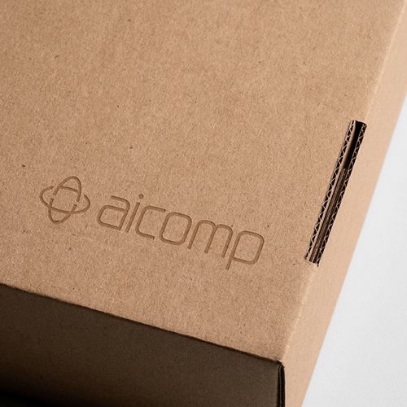
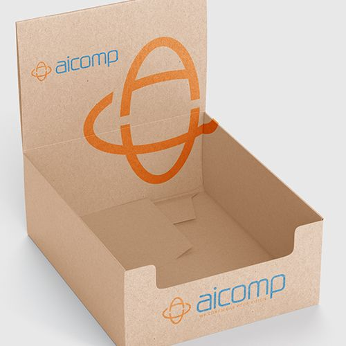
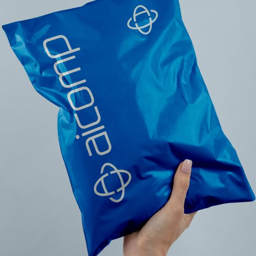
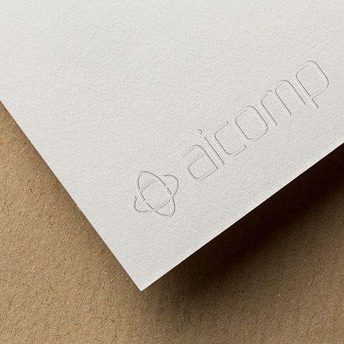

  

  &nbsp;
  &nbsp;
  &nbsp;
  

---

## Who We Are

> **Aicomp** is a specialized ERP software provider for the **Paper & Packaging industry** with **20+ years of experience**. We develop and implement industry-specific solutions that enable manufacturers to run faster CPQ processes and full end-to-end operations — reducing complexity while increasing efficiency.

---

## Industry Solutions

We deliver **preconfigured ERP solutions** tailored to the specific needs of packaging manufacturers:

<table>
<tr>
<th align="center" width="110"></th>
<th align="left">Industry</th>
<th align="left">Description</th>
</tr>
<tr>
<td align="center"></td>
<td><strong>Corrugated Board</strong></td>
<td>From simple sheets to FEFCO cartons and complex POS displays</td>
</tr>
<tr>
<td align="center"></td>
<td><strong>Folding Carton</strong></td>
<td>ECMA standard products to multi-part products with complex CAD designs</td>
</tr>
<tr>
<td align="center"></td>
<td><strong>Flexible Packaging</strong></td>
<td>Simple film to complex bags, incl. recipe management</td>
</tr>
<tr>
<td align="center"></td>
<td><strong>Board &amp; Paper</strong></td>
<td>Pulp &amp; paper reels and sheets with detailed recipe &amp; consumption management</td>
</tr>
</table>

---

## Software Portfolio

<table>
<tr>
<th align="center">Logo</th>
<th align="left">Product</th>
<th align="left">Type</th>
<th align="left">Description</th>
</tr>
<tr>
<td align="center"></td>
<td><a href="https://www.aicomp.com/vcpowerpack/"><strong>VCPowerPack</strong></a></td>
<td>SAP Add-on (ABAP)</td>
<td>Extends &amp; improves variant configuration in SAP ERP &amp; S/4HANA</td>
</tr>
<tr>
<td align="center"></td>
<td><a href="https://www.aicomp.com/cubicus/"><strong>Cubicus</strong></a></td>
<td>SaaS Add-on</td>
<td>Cloud-based CPQ product configuration for any ERP system</td>
</tr>
<tr>
<td align="center"></td>
<td><a href="https://www.aicomp.com/iq-catalyst/"><strong>IQ.catalyst</strong></a></td>
<td>ML Platform</td>
<td>Machine Learning platform for packaging intelligence</td>
</tr>
<tr>
<td align="center"></td>
<td><a href="https://www.aicomp.com/ecoagent/"><strong>EcoAgent</strong></a></td>
<td>Sustainability</td>
<td>Sustainability assessment &amp; reporting</td>
</tr>
<tr>
<td align="center"></td>
<td><a href="https://www.aicomp.com/pricing-portal/"><strong>Pricing Portal</strong></a></td>
<td>Costing Framework</td>
<td>Streamlined costing &amp; pricing processes</td>
</tr>
<tr>
<td align="center"></td>
<td><a href="https://www.aicomp.com/tooling-manager/"><strong>Tooling Manager</strong></a></td>
<td>Tooling Management</td>
<td>End-to-end tooling lifecycle management</td>
</tr>
</table>

---

**© 2026 Aicomp Group · [aicomp.com](https://www.aicomp.com) · [Imprint](https://www.aicomp.com/imprint) · [Privacy Policy](https://www.aicomp.com/privacy-policy)**

